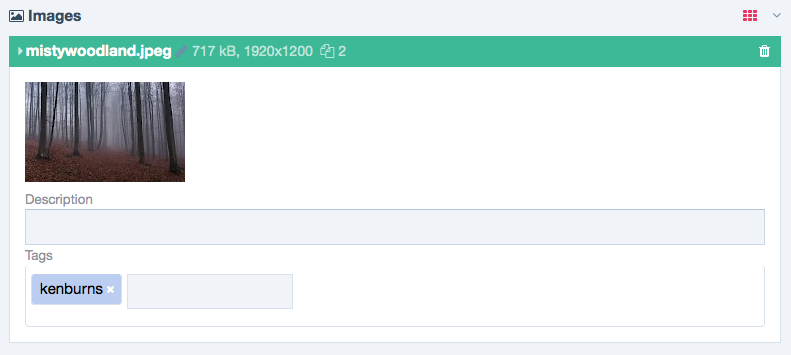

#Autocomplete Image Tags



**A simple way to add autocomplete and 'tags' to your tags field.**

© 2015 Macrura

---

### Install


1. Add ProcessPageEditAutocompleteImageTags.js and ProcessPageEditAutocompleteImageTags.css to your 'AdminCustomFiles' folder.
2. Download aehlke's [tag-it](http://aehlke.github.io/tag-it/) from GitHub.
3. Unzip it & find **tag-it.min.js**, place it next to the other files in the 'AdminCustomFiles' folder.
4. Go to the AdminCustomFile [settings](/processwire/module/edit?name=AdminCustomFiles).
5. Enable for process: **ProcessPageEdit**.
6. In the dependencies textarea paste in: ```ProcessPageEdit /AdminCustomFiles/tag-it.min.js```
7. Press submit.

Thanks!
